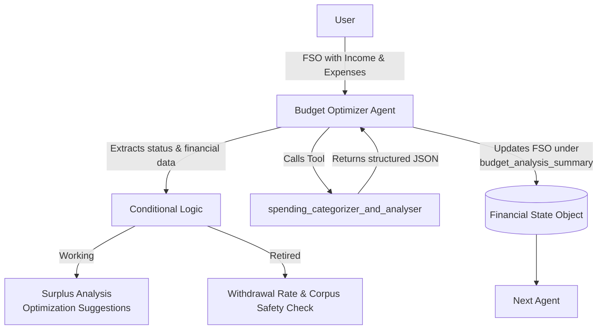

# Budget Optimizer Agent – README

## Overview

The **Budget Optimizer Agent** is part of the Financial Planner Orchestrator pipeline. Its responsibility is to analyze a user’s cash flow, evaluate surplus/deficit, apply budgeting heuristics such as the 50/30/20 rule, and update the Financial State Object (FSO). It also calls a deterministic tool to perform structured spending analysis and integrates the result back into the FSO. The agent supports both **Working** and **Retired** user workflows.

## Architecture



## Agent Logic

### Input

The agent receives the **FSO as a JSON string**.

### Output

The **only output** must be the **updated FSO** containing:

```
"budget_analysis_summary": { ... }
```

### Processing Flow

1. Parse FSO from JSON string.
2. Extract:
   - `user_status`
   - Monthly income
   - Expense categories
   - Emergency fund
3. Branch logic:
   - **Working** → Surplus calculation, expense optimization.
   - **Retired** → Withdrawal rate & corpus safety.
4. Invoke tool `spending_categorizer_and_analyser()`.
5. Insert returned JSON into the FSO under `budget_analysis_summary`.
6. Return updated FSO.

## Tool Definition

### spending_categorizer_and_analyser()

#### Input

```python
monthly_net_income_inr: float
fixed_expenses_inr: float
variable_expenses_inr: float
discretionary_spending_inr: float
target_savings_inr: float = 0.0
```

#### Output (JSON)

```json
{
  "total_monthly_net_income_inr": ...,
  "total_monthly_expenses_inr": ...,
  "net_cash_flow_inr": ...,
  "goal_funding_status": "...",
  "funding_shortfall_inr": ...,
  "optimization_areas": ["...", ...]
}
```

### What It Does

- Calculates expenses and cash flow.
- Identifies overspending (discretionary > 30% of income).
- Validates fixed expense load (<50% ideal).
- Computes surplus, deficit, and target savings shortfall.
- Returns actionable optimization suggestions.

## FSO Update Structure

The agent updates:

```json
"budget_analysis_summary": {
    "total_monthly_net_income_inr": ...,
    "total_monthly_expenses_inr": ...,
    "net_cash_flow_inr": ...,
    "goal_funding_status": "...",
    "funding_shortfall_inr": ...,
    "optimization_areas": [...]
}
```

If high-interest debt or poor withdrawal metrics are detected:

```json
"debt_flag": true
```

## Examples

### Working User Output

```json
{
  "budget_analysis_summary": {
    "total_monthly_net_income_inr": 85000,
    "total_monthly_expenses_inr": 72000,
    "net_cash_flow_inr": 13000,
    "goal_funding_status": "On track",
    "funding_shortfall_inr": 0,
    "optimization_areas": [
      "Discretionary spending is above recommended levels.",
      "Your monthly surplus is thin. Optimize variable expenses."
    ]
  }
}
```

### Retired User Output

```json
{
  "budget_analysis_summary": {
    "withdrawal_rate_percent": 6.2,
    "safe_withdrawal_threshold_percent": 4,
    "risk_flag": "High withdrawal rate",
    "optimization_areas": [
      "Reduce discretionary spending and reassess emergency fund."
    ],
    "goal_funding_status": "Shortfall"
  }
}
```

## Error Handling

- Tool never throws exceptions.
- Any upstream validation errors are handled in the data collection phase.
- The agent never breaks FSO structure.
- Output is always valid JSON.

## Developer Notes

- The agent is **idempotent** (same input → same output).
- Designed for token-efficient FSO subsetting.
- Tool calls are deterministic and safe inside retries.
- Works with Standardized Financial Data Collector formats.
